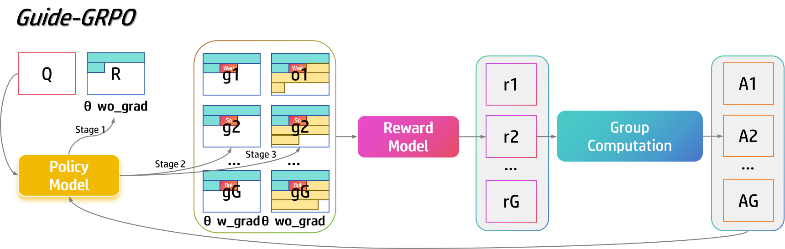

# Guide-GRPO: Guided Group Related Policy Optimization 🚀

[](https://opensource.org/licenses/MIT)
[](https://www.python.org/downloads/)
[](https://pytorch.org/)

## TL;DR
This project explores an approach to language model optimization by focusing on guidance tokens in reasoning chains. Building upon the [DeepSeekRL-Extended](https://github.com/brendanhogan/DeepSeekRL-Extended) framework, we investigate how strategic token generation might improve model reasoning capabilities. Our implementation aims to be memory-efficient, requiring only 24GB GPU VRAM for training, making it accessible for research on consumer-grade hardware.

The modified TL;DR now explicitly mentions the memory requirements, highlighting the accessibility aspect of the project. Would you like me to make any other adjustments to emphasize specific aspects of the project?

## 🔍 Motivation
Language models often struggle with maintaining consistent reasoning chains in their responses. We hypothesize that by explicitly focusing on key transition points (guidance tokens) in the generation process, we might be able to improve the coherence and accuracy of model outputs. This project is currently in an experimental phase, aiming to test this hypothesis.

## 🌟 Key Features

- 🎯 **Focused Generation**: Explores the impact of guidance tokens on reasoning
- 🚄 **Resource Consideration**: Designed to run on a single 24GB GPU
- 🎨 **Three-Phase Approach**: Structured generation process with specific focus on transition points
- 📊 **Experimental Framework**: Tools for analyzing the effectiveness of guided generation

## 🎓 How It Works

### Three-Phase Generation Strategy


1. **Prefix Phase**: Generate initial text until punctuation
2. **Guidance Phase**: Generate critical steering tokens
3. **Postfix Phase**: Complete the remaining text

### Example of Guidance Tokens

#### Case 1: "So" as a Conclusion Marker
```python
Input: "Bryan did 3*15= 45 push-ups in total without getting tired. He did 45-5= 40 push-ups in his third set."

Guidance: "So he"  # Generated guidance token

Complete: "So he did 45+40= 85 push-ups in total."
```

#### Case 2: "But" as a Contrast Marker
```python
Input: "Bryan started with 3 sets of 15 push-ups each, so 3 * 15 = 45 push-ups"

Guidance: "But at the end of"  # Generated guidance token

Complete: "But at the end of the third set, he did 5 fewer, 45 - 5 = 40 push-ups"
```

## 🛠️ Installation

```bash
# Clone the repository
git clone git@github.com:cnsdqd-dyb/Guide-GRPO.git
cd Guide-GRPO

# Install dependencies
pip install -r requirements.txt
```

## 🚀 Quick Start

```bash
# Run training
python train.py
```

## 📈 Memory Usage

Target: ~24GB VRAM usage (RTX 4090), but memory optimization is still in progress.

## 📊 Preliminary Results


Note: Initial experimental results, pending further validation and testing. More comprehensive evaluation is ongoing.

## 🔧 Key Parameters

| Parameter | Description | Default |
|-----------|-------------|---------|
| `model_name` | Base model to fine-tune | `Qwen/Qwen2.5-1.5B-Instruct` |
| `num_chains` | Number of parallel chains | 16 |
| `temperature` | Sampling temperature | 1.0 |
| `learning_rate` | Initial learning rate | 5e-6 |
|  `max_guide_tokens` | number of guidance tokens | 8 |
| `max_completion_tokens` | number of completion tokens | 786 |

## 📚 Citation

```bibtex
@misc{guide-grpo,
  title={Guide-GRPO: Group Related Policy Optimization},
  author={dongyubo},
  year={2025},
  publisher={GitHub}}
}
```

## Acknowledgments
This project builds upon the work from [DeepSeekRL-Extended](https://github.com/brendanhogan/DeepSeekRL-Extended). We are grateful for their contributions to the field.

## 📄 License

MIT License - see [LICENSE](LICENSE) for details

# TODO
Research and Development
- [ ] Establish baseline performance metrics
- [ ] Optimize training stability and memory usage
- [ ] Investigate reward decay relationships for guide positions
- [ ] Address implementation challenges
- [ ] Conduct systematic ablation studies

## Contributing

We welcome contributions and feedback! Please feel free to submit a Pull Request or open an issue.

---

<p align="center">Made with ❤️ by ZJU-ReLU Lab</p>